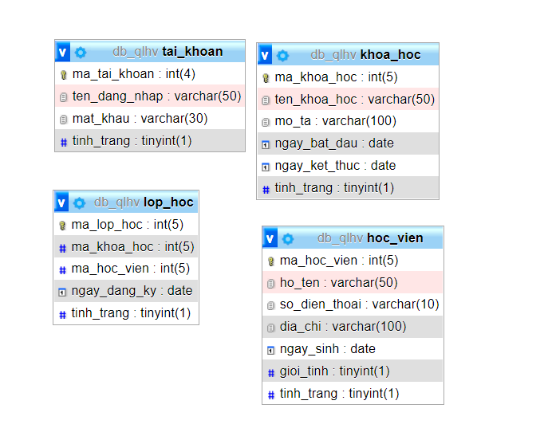
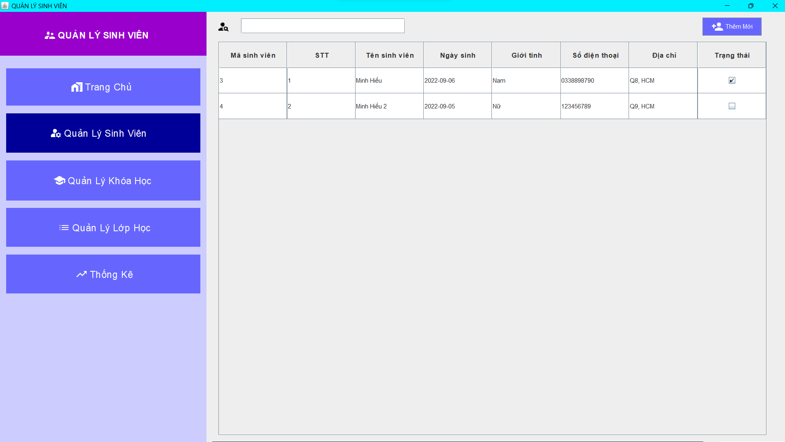
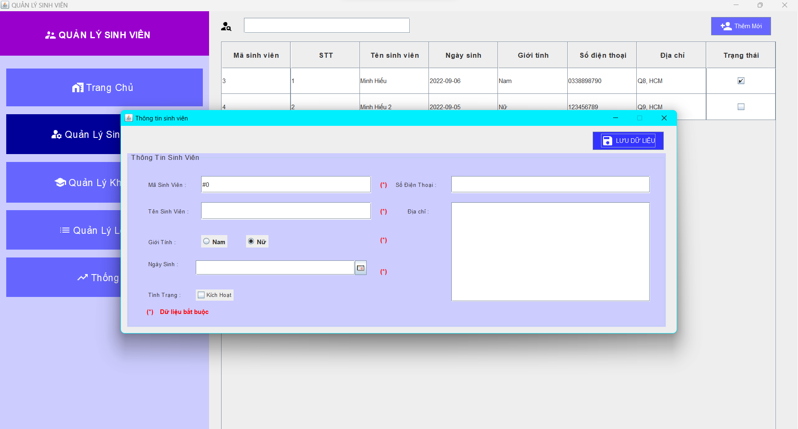

# Lập trình Java - Sử dụng ngôn ngữ Java viết app desktop. (Quản lý lớp học)


 

## Thành viên nhóm

| STT |    MSSV    | Họ và tên             |
| :-: | :--------: | --------------------- |
|  1  | 3119410439 | Minh Hiếu Calan Tog   |


## Yêu Cầu:

- Xây dựng trên ngôn ngữ Java, sử dụng mô hình 3 lớp, có kết nối db <br/>

## Database




## Hướng dẫn cài đặt

Phần mềm chạy tốt với độ phân giải màn hình chuẩn của máy là > 1280x900 ( FullHD )

```
1. Tạo database "db_qlhv" và import file "db/db_qlhv.sql" vào phpadmin trên XAMPP .
```

```
2. Build và run chương trình.
```

## Một số giao diện của chương trình



